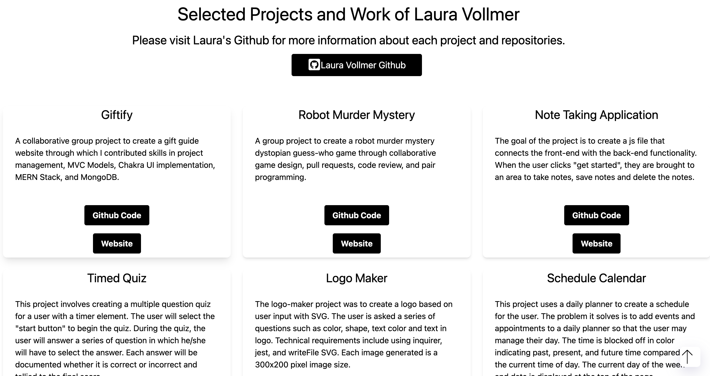
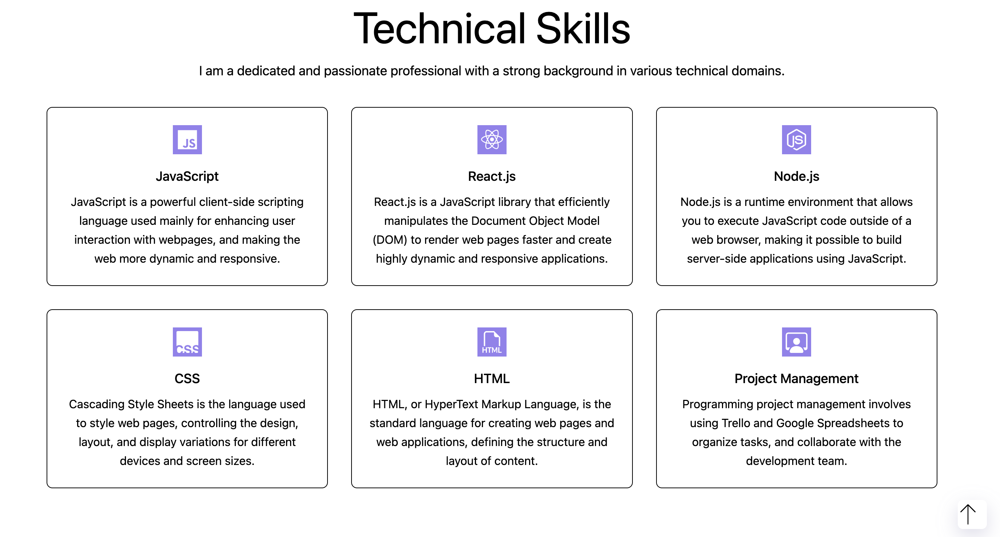
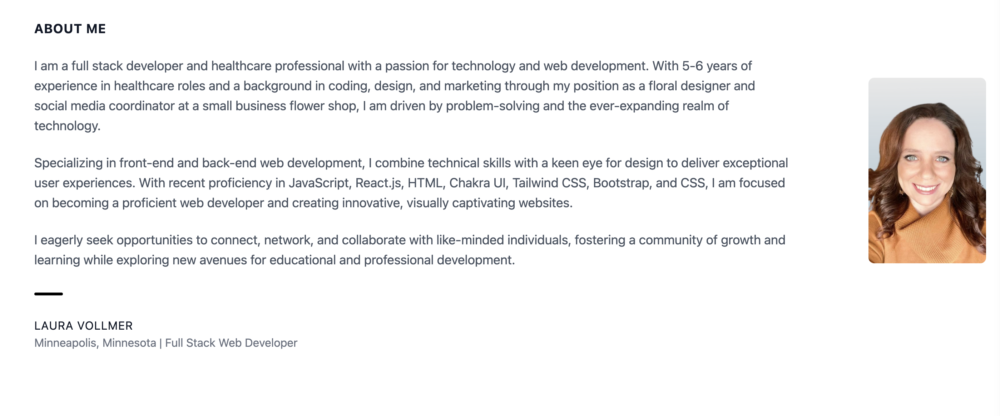
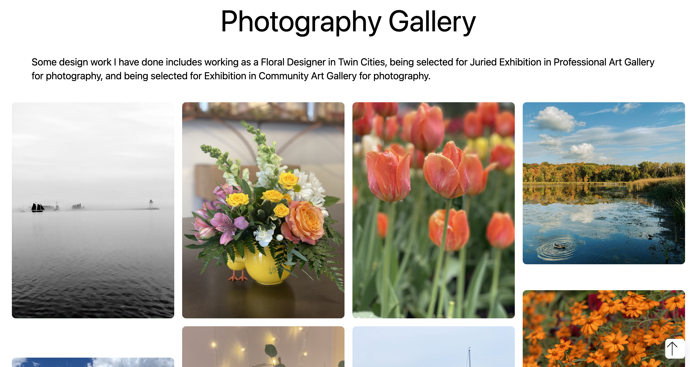
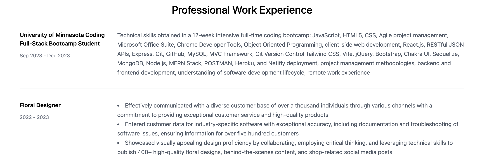
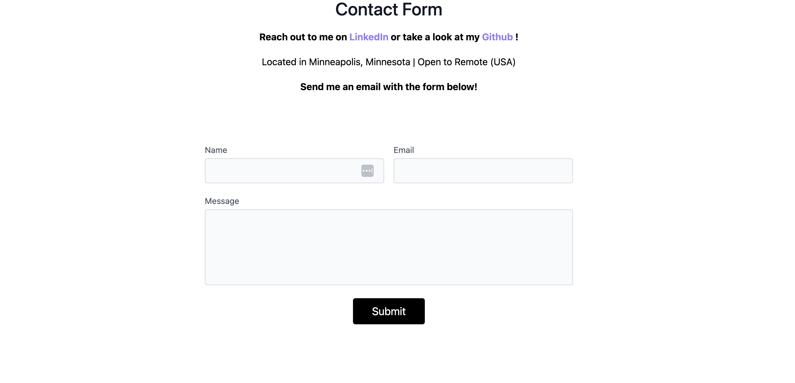

# Portfolio-Website

## Project Description

A modern, mobile responsive and user-friendly web development portfolio website crafted with ReactJS, TailwindCSS, Vite, and JavaScript. This solo project showcases a sleek, and mobile-responsive interface. The Lighthouse report for this website lists 100 in best practices and SEO. The portfolio encompasses a Home Page, Navigation, About, Projects, Technical Skills, Photography Gallery, and Contact section. Each section has been meticulously created with care and is continuously updated to ensure an engaging experience.

## Table of Contents

- [Technical Requirements](#technical-requirements)
- [Tech Stack](#tech-stack)
- [Website Screenshots](#website-screenshots)
- [Website Links](#website-links)
- [Author](#author)
- [Acknowledgements](#acknowledgements)
- [Licenses](#licenses)

## Technical Requirements

To run and use this project, you will need to have the following prerequisites and dependencies installed:

- React.js
- TailwindCSS
- Vite Project
- JavaScript
- React Icons
- Coolors
- React-Type-Animation
- FontAwesome Icons
- Google Fonts
- ScrollToTop
- EmailJS

Please ensure that you have these components and libraries installed and properly configured on your system before proceeding with the installation and usage of this project. You may need to install them using package managers like npm or yarn. Refer to their respective documentation for installation instructions.

Additionally, this project requires access to Netlify and Namecheap for deployment and domain management. Make sure you have appropriate accounts and credentials for these services.

Lastly, you will need to include the necessary API keys or configuration files for any external services used in this project. Refer to the documentation or configuration files provided for more information on setting up these dependencies.

## Tech Stack

Technical Requirements of the project include:

- React.js
- TailwindCSS
- Vite Project
- JavaScript
- React Icons
- Coolors
- React-Type-Animation
- Netlify
- Namecheap
- Flowbite
- FontAwesome Icons
- Google Fonts
- ScrollToTop
- EmailJS

## Website Screenshots

Below are the screenshots of the website.

Home Page:

Navigation Bar:

Project Page:

Skills Page:

About Page:

Photography Gallery Page:

Work Experience Page:

Contact Page

## Website Links

Github Repo:https://github.com/lavollmer/portfolio-website

Deployed Website:https://lauradeveloper.com/

## Author

This project was created and is maintained by Laura Vollmer who is passionate about delivering high-quality software solutions. Get to know the author behind this project:

- Completed a Full-Stack Web Development Coding Bootcamp at the University of Minnesota 2023
- Diverse work experience in healthcare and floral design
- Continuously updating the website with new information learned

If you have any questions, suggestions, or issues regarding this project, please don't hesitate to reach out.

## Acknowledgements

I extend gratitude to all the individuals, communities, and organizations that have inspired and supported me throughout the development of this project. Your contributions have played a significant role in its success.

- Background Image Unsplash: https://unsplash.com/photos/a-pink-and-blue-background-with-a-lot-of-bubbles-2dyR13FNg2I
- Tailblocks: https://tailblocks.cc/
- React-Type-Animation: https://www.npmjs.com/package/react-type-animation
- Coolors optimized color palette generator
- FontAwesome Icons: https://fontawesome.com/icons/mug-saucer?f=classic&s=solid
- Google Fonts: Poppins
- ScrollToTop: https://www.npmjs.com/package/react-scroll-to-top
- Inspiration for Gallery Images: https://flowbite.com/docs/components/gallery/

## Licenses

No license
